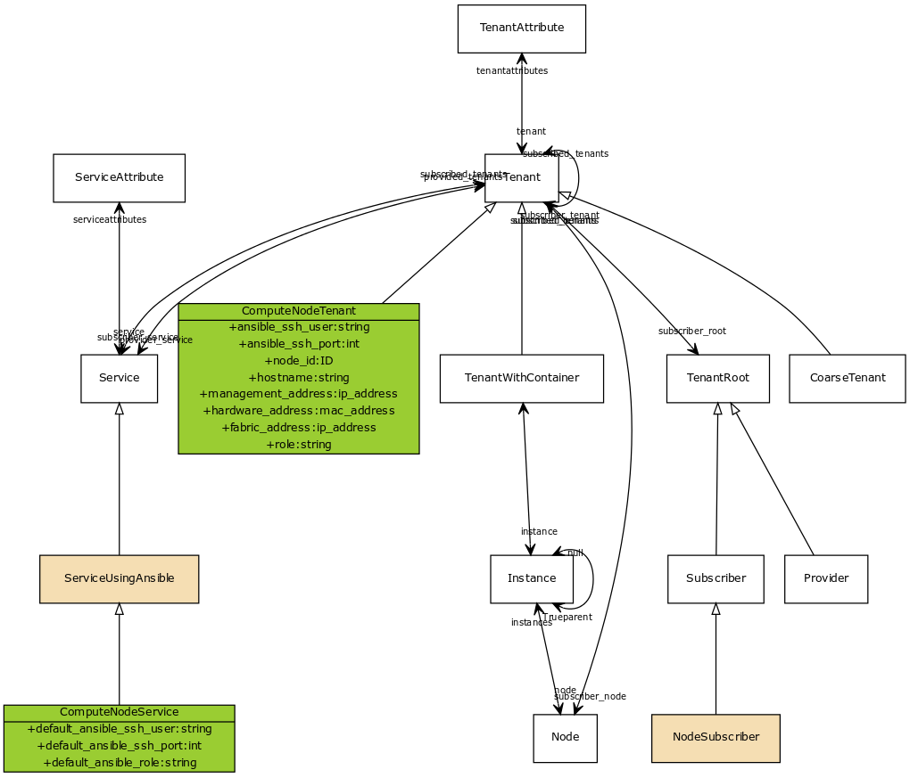

# Compute Node XOS Service
This repository defines an OpenCORD (https://github.com/opencord) XOS service
to provisioning a new compute node into the CORD POD.

### Model Integration in XOS
The following diagram indicates where the ComputeNodeService fits into the
XOS service model. The classes with a `tan` background are classes that are
added or augmented either in the core model. The classes with a `green`
background are classes that are developed as part of the ComputeNodeService.

